# Analysis of the Frobenius Metric on Kuramoto Networks
### PREMECE
The SVISE method had been used, in order to perform analysis with trygonometric functions, a change to the original program has been made, in sde_learning and sparse_glm.py
## Overview
This project investigates the variation of the **Frobenius Metric** across different types of neural networks (SBM, ER, BA) based on threshold t values and different coupling constants (0.3, 0.5, 0.8). The goal is to verify the effectiveness of the **SVISE method** and the **SINDy method** on networks with a constant number of connections but different topologies.

### Frobenius Metric Graphs
Below are the graphs of the Frobenius Metric for each value of SNR ( 60, 80, 100 ). Each graph includes all network types (SBM, ER, BA).

#### SINDy (SNR = 100) 
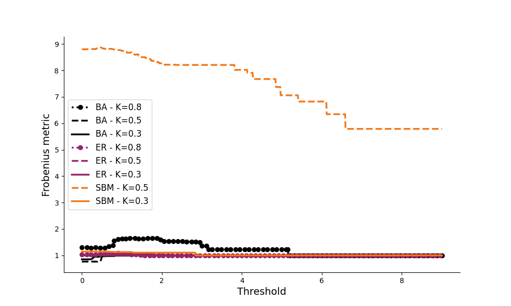
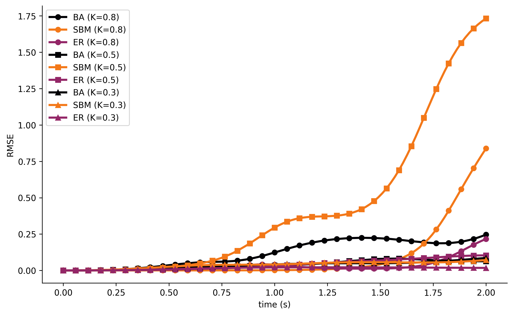

#### SVISE (SNR = 100)
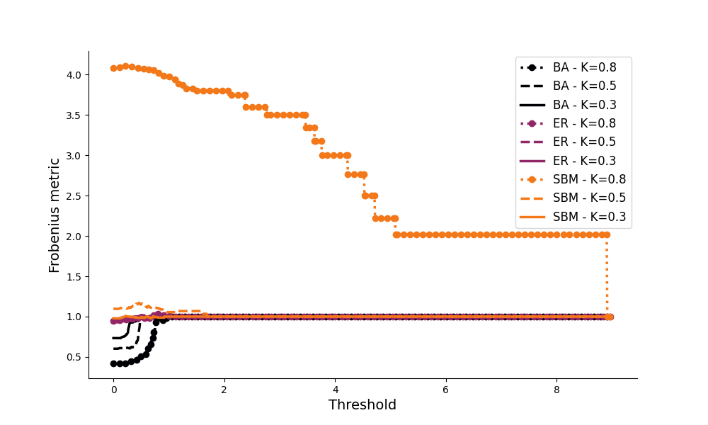
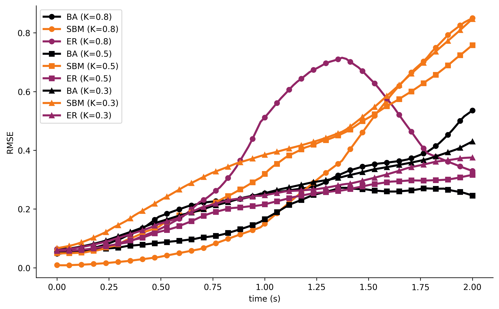

#### SINDy (SNR = 80) 

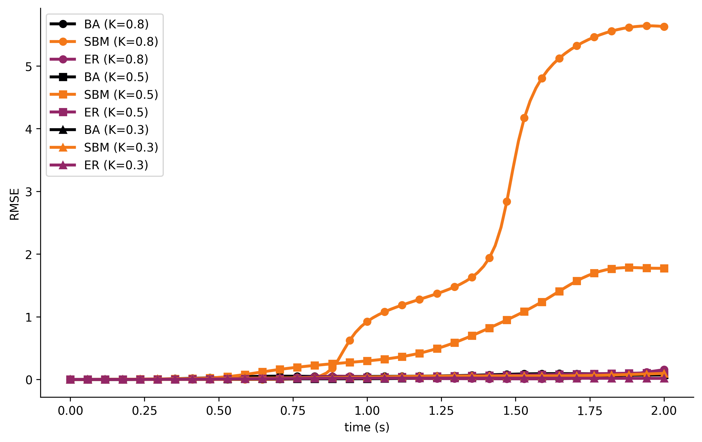

#### SVISE (SNR = 80)
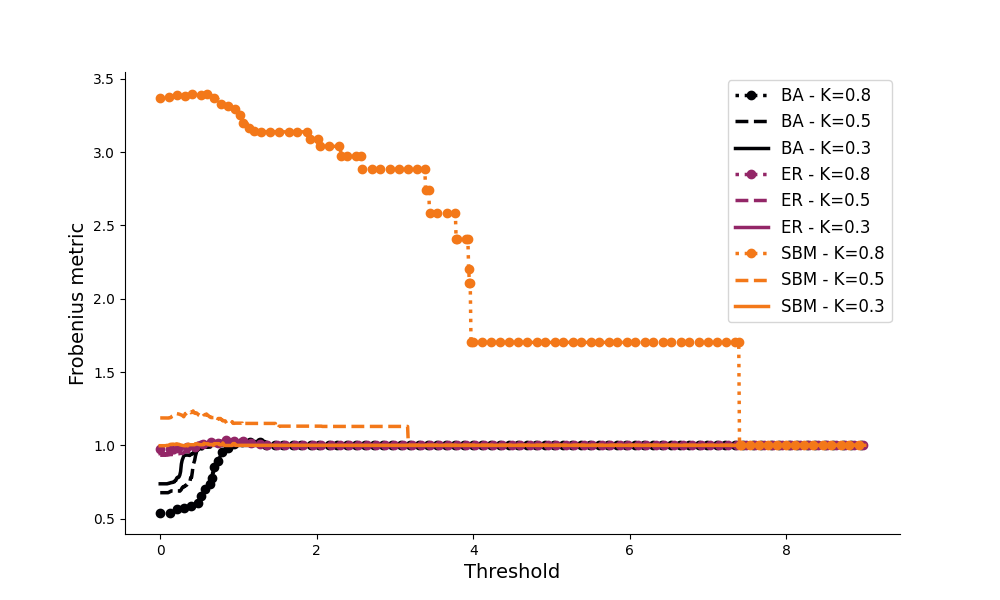
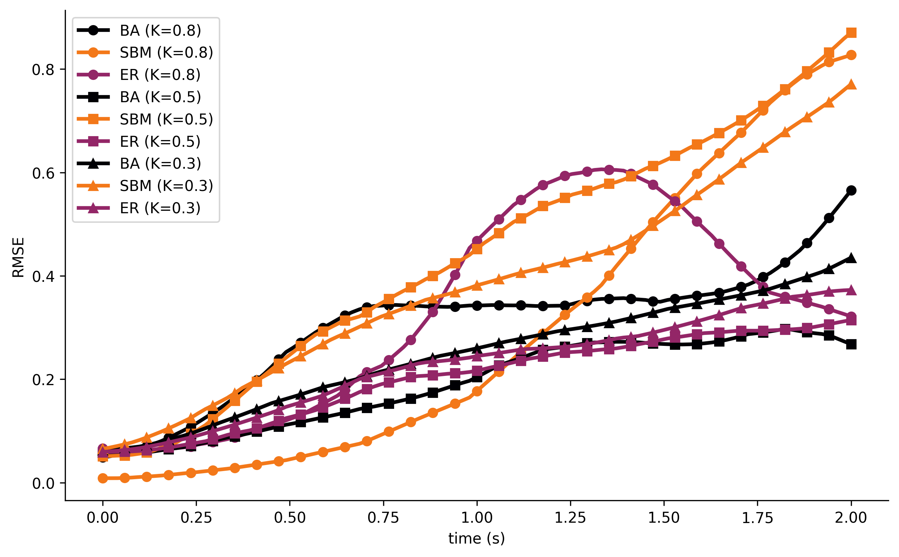

#### SINDy (SNR = 60) 
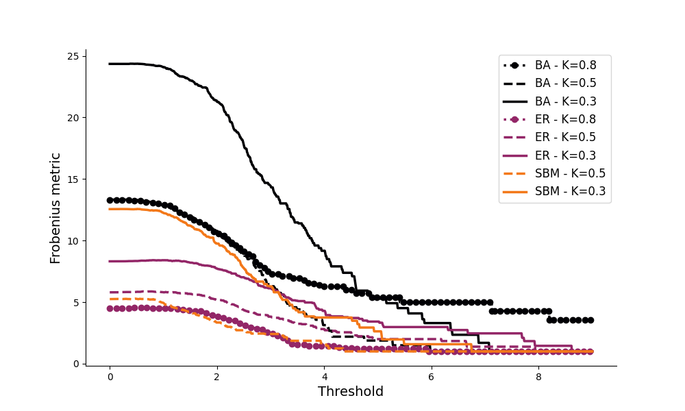
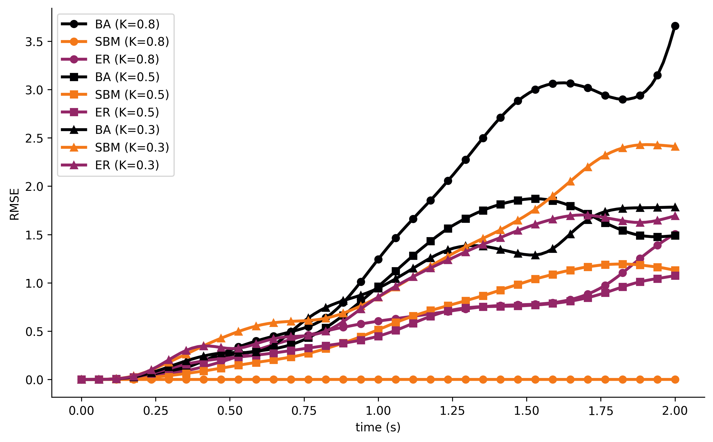

#### SVISE (SNR = 60)
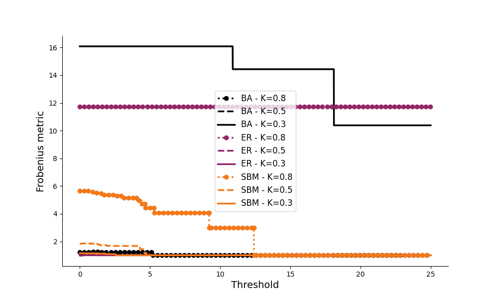
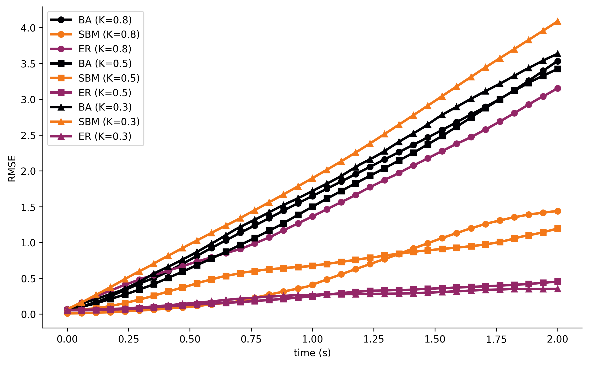

## Discussion
From the graphs, we observe that:
- **[Observation 1]**: The Frobenius Metric is notably higher for the SBM topology for SNR = 100 and 80, while it performed better on higher noise ( SNR = 60).
- **[Observation 2]**: Similarly the RMSE of the SBM topology performed worse than BA and ER on SNR = 100 and 80, while it did better with (SNR = 60 ).
- **[Observation 3]**: Both methods perform better with lower noise, in the case of SNR = 100 SVISE performs more consistent, meaning that every topology show a similar result, on the other hand SINDy scored the best result but the performance on SBM was worse among the 2 methods.
- **[Observation 4]**: SBM with K = 0.3 performed particularly bad, making it not suitable to show on a graph with others. Other than that there is no particular preferance for the coupling constant.

