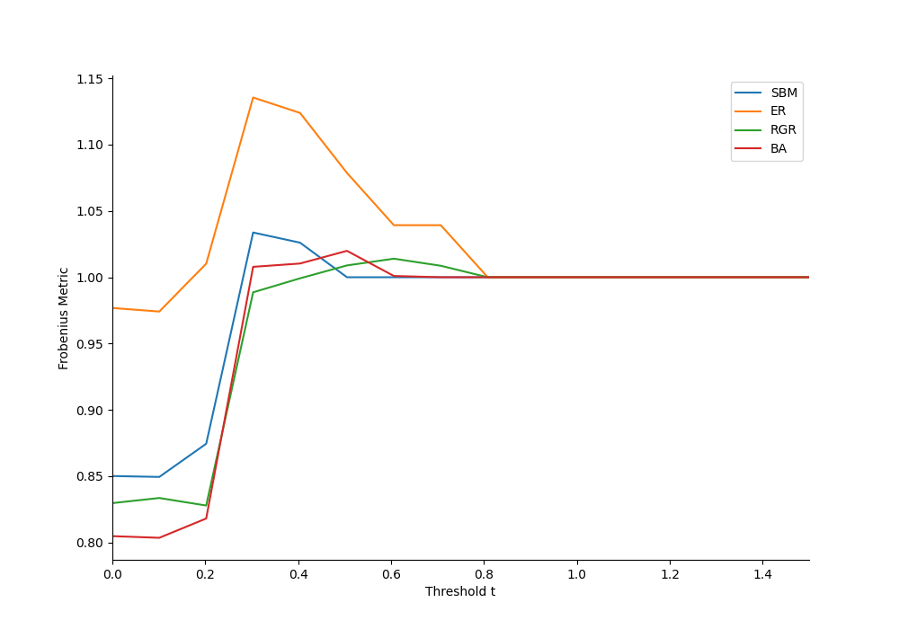
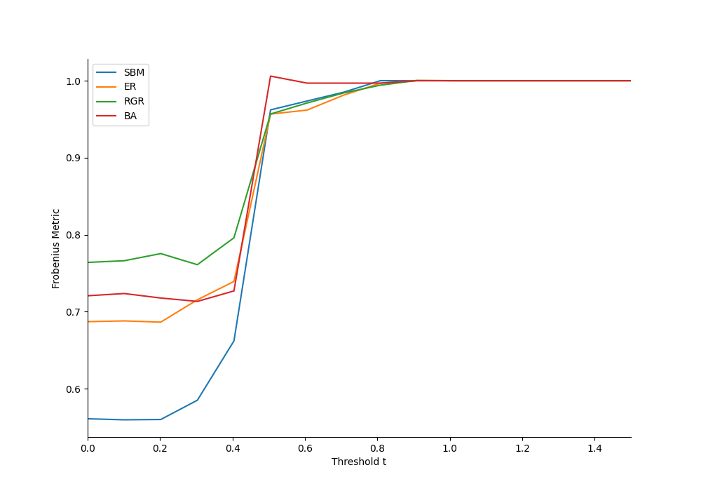
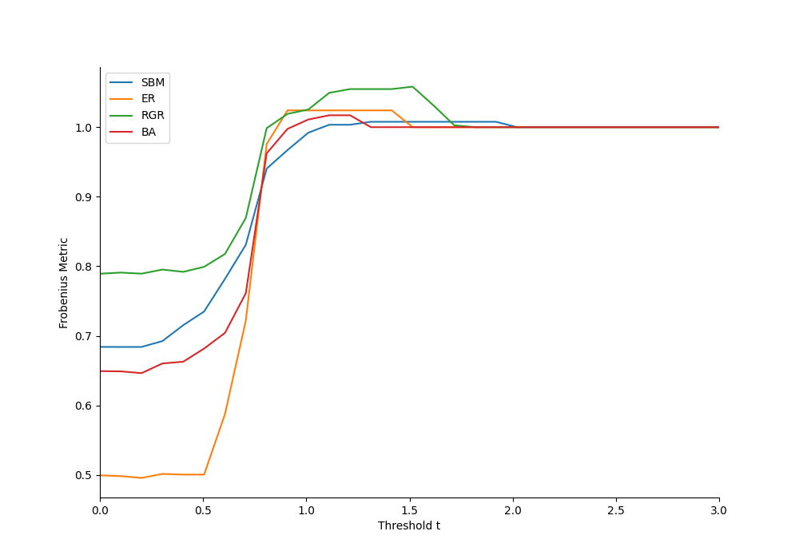
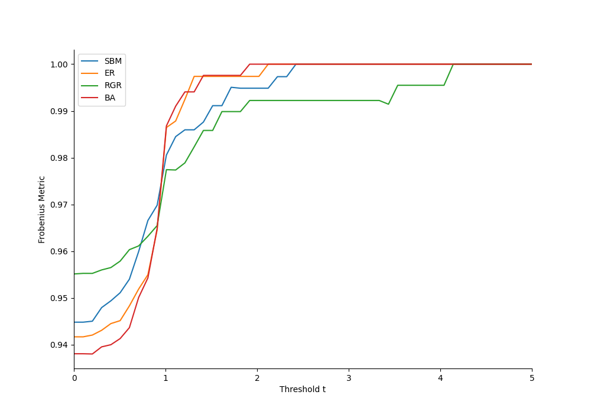

# Analysis of the Frobenius Metric on Neural Networks

## Overview
This project investigates the variation of the **Frobenius Metric** across different types of neural networks (SBM, ER, RGR, BA) based on threshold \( t \) values and different coupling constants (0.3, 0.5, 0.8, 1). The goal is to verify the effectiveness of the **SVISE method** on networks with a constant number of connections but different topologies.

## Data and Method
Data was obtained by comparing estimated coefficient matrices and original adjacency matrices (scaled by the coupling constant). The **Frobenius Metric** was calculated by applying various thresholds to the estimated matrix and computing the normalized Frobenius norm of the difference between the thresholded estimated matrix and the modified adjacency matrix.

## Results

### Frobenius Metric Graphs
Below are the graphs of the Frobenius Metric for each coupling constant \( K \). Each graph includes all network types (SBM, ER, RGR, BA) with different line styles.

#### 1. Coupling Constant \( K = 0.3 \)

#### 2. Coupling Constant \( K = 0.5 \)

#### 3. Coupling Constant \( K = 0.8 \)

#### 4. Coupling Constant \( K = 1 \)

## Discussion
From the graphs, we observe that:
- **[Observation 1]**: For example, for \( K = 0.3 \), the Frobenius Metric varies more significantly among network types, indicating that SBM networks are particularly sensitive to this coupling constant.
- **[Observation 2]**: As \( K \) increases, the Frobenius Metric stabilizes across network types, suggesting that higher coupling constants may reduce sensitivity to topology differences.

## Conclusion
The results indicate that the effect of the coupling constant on the Frobenius norm varies significantly depending on the network topology. This has implications for interpreting network connectivity, particularly concerning thresholding parameters in network analysis using the SVISE method.

## Notes
- Graphs were generated automatically and saved in the `Graphs` folder.
- Each graph shows the **Frobenius Metric** as a function of threshold \( t \), limited to the relevant range \( t \leq 1.5 \).
