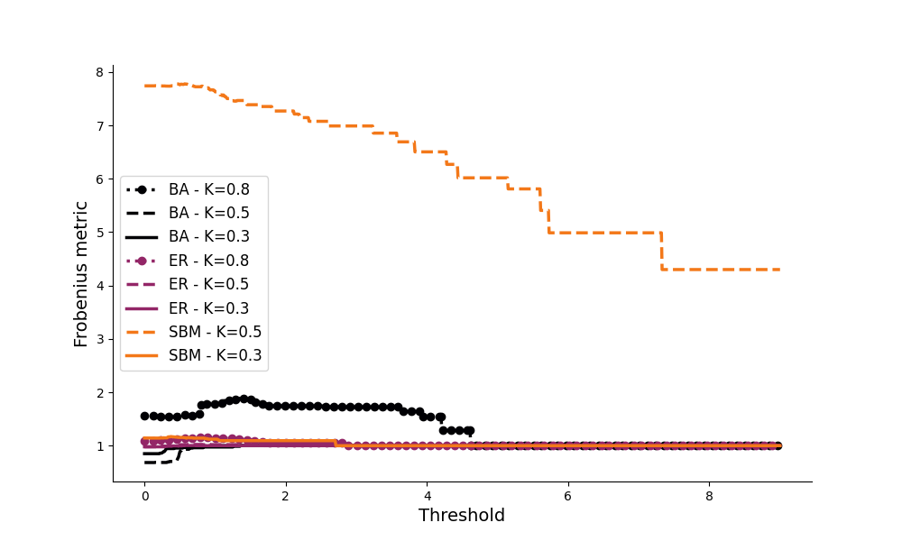

# Analysis of the Frobenius Metric on Kuramoto Networks

## Overview
This project investigates the variation of the **Frobenius Metric** across different types of neural networks (SBM, ER, BA) based on threshold t values and different coupling constants (0.3, 0.5, 0.8). The goal is to verify the effectiveness of the **SVISE method** and the **SINDy method** on networks with a constant number of connections but different topologies.

### Frobenius Metric Graphs
Below are the graphs of the Frobenius Metric for each value of SNR ( 60, 80, 100 ). Each graph includes all network types (SBM, ER, BA).

#### 1. SNR = 100 

#### 2. SNR = 80

#### 3. SNR = 60

## Discussion
From the graphs, we observe that:
- **[Observation 1]**: The Frobenius Metric is notably higher for the Random Geometric Graph topology, while the other three topologies do not show a consistent advantage over one another.
- **[Observation 2]**: There is no clear preference for the value K, the best results, meaning those with lower Frobenius metrics at t=0, where K= 0.5 and 0.8.

## Conclusion
The results indicate that the effect of the coupling constant could cause the Frobenius norm to vary but there is no clear evidence for a preference towards a topology among SBM, BA or ER while the RGR performed worse than the other 3.

